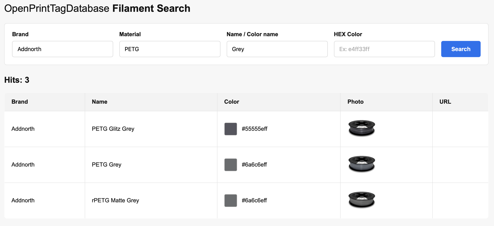
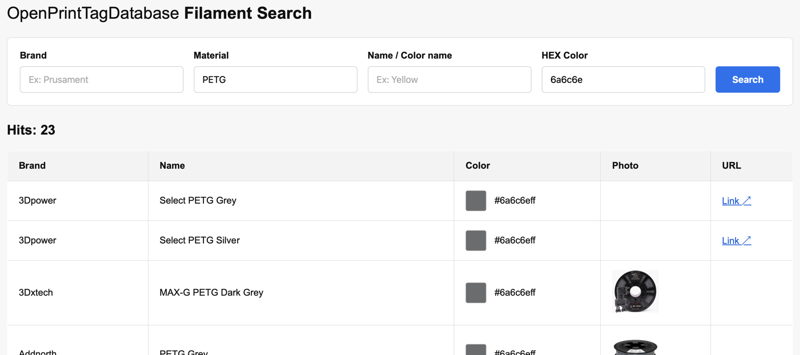

# OpenPrintTagDatabase Search

   
  Simple search for f6fb38 (Variant of yellow.)

## Features
Python Flask script for searching the OpenPrintTag Database by filament color and optional material type.

The script searches through all material YAML files and returns matching: 

- Brands 
- Filament names 
- material types 
- color hex values 
- Picture of the filament color and webpage link.
- - (Not available for all filaments in the database)
---

## Example
Searching for a substitute for Brand Addnorth PETG Grey.

   
  Addnorth PETG Grey

Now we have the correct RGB value to search: #6a6c6eff.

   

